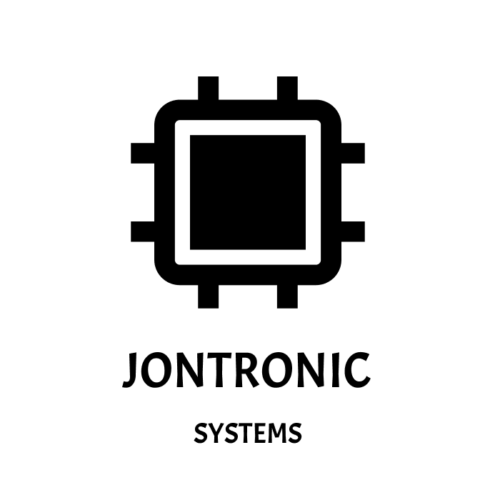

# Modbus protocol - Reading Registers

This project is a Python-based program running on a microcontroller (such as a Raspberry Pi Pico) using the UART interface to communicate with a Modbus RTU device. The program reads the battery voltage register from a connected Modbus slave device (e.g., Renogy Wanderer) and prints the battery voltage.

## Features

- UART communication with Modbus RTU devices.
- Reads battery voltage from a Modbus slave.
- CRC error checking for reliable data transmission.
- Configurable UART pins and communication settings.

## Requirements

- Microcontroller (e.g., Raspberry Pi Pico) with UART support.
- Python with machine module support (e.g., MicroPython).
- A Modbus RTU device (slave) supporting reading of holding registers.
- UART TX and RX pins connected to the Modbus RTU device.

## Installation

1. **Install MicroPython** on your microcontroller (e.g., Raspberry Pi Pico).
2. **Upload the script** to your microcontroller using a tool like Thonny or `ampy`.
3. **Wire the UART pins** (TX and RX) from your microcontroller to the Modbus RTU device:
    - TX ? Modbus RX
    - RX ? Modbus TX
    - GND ? GND

## Hardware Pin Configuration

The program uses the following GPIO pins for UART communication:

- **TX (Transmit):** GPIO4
- **RX (Receive):** GPIO5

Here’s the circuit diagram for connecting the microcontroller to the Modbus RTU device:

You can modify the pin configuration in the script if necessary.

## Usage

1. Upload the program to your microcontroller.
2. Connect your microcontroller to the Modbus RTU device.
3. Run the program using the Python interpreter on the microcontroller.

The program will attempt to read the battery voltage from the Modbus slave with address `1` and print the result in volts.

## Techs

  
  
  

###
